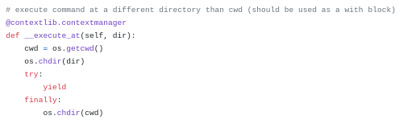
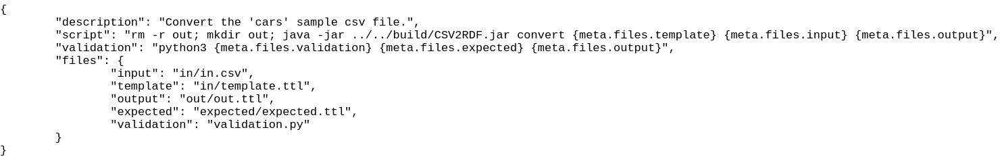
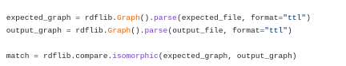

### Automatizált tesztfuttató keretrendszer kialakítása funkcionális tesztek alkalmazásához

A folytonos integráció során lehetőségünk van többek között egységtesztek futtatására, kódfedettség mérésre és a szoftver automatikus kiadására is. A fejezet bemutatja a csapat által kifejlesztett python nyelvű keretrendszert, amit az automatizált funkcionális teszteléshez használtunk.

Kezdjük el az elképzeléstől. Funkcionális tesztelés során az automatizálást valamilyen szkriptelési környezetben kívántuk megvalósítani. Fontos szempont volt a tesztek egyedi kialakítása, hiszen különféle működéseket teszteltünk. Arra a megoldásra jutottunk, hogy minden teszthez egyedi konfigurációs fájlt és ellenőrző szkriptet készítünk.

## Automatizált tesztfuttató

Az automatizált tesztfuttató környezet megvalósításához a python nyelvet választottuk az egyszerűen kezelhető és hatékony magas szintű szitnaxisa miatt.

A tesztfuttató automatikusan beolvassa az összes teszteset konfigurációs fájlját, kiegészíti a fájl parancsait a különböző sablonparaméterekkel (pl. kimeneti fájl neve) és végrehajtja a tesztek futtatását.

    
<em>Magas szintű python kód.</em>

> Az automatikus tesztelő keretrendszer néhány alapvető kényelmi funkcióval is rendelkezik (pl. paraméterek ellenőrzése, test root váltása). Így a CI-be is könnyen be lehetett kötni.

## Konfigurációs fájl

Minden funkcionális teszt saját konfigurációs fájlt kapott. A konfiogurációs fájl egy JSON állomány, amely a teszteléshez használt parancsokat, valamint a tesztelésben részt vevő fájlok neveit tartalmazza.

    
<em>Szétszórt módon szervezett lib mappa. Példa konfigurációs fájl.</em>

## Validációs szkript

Az egyes tesztesetekhez használt validációs szkript tetszőleges kódot tartalmazhat az ellenőrzéshez.

    
<em>Egyedi teszteset validáció.</em>

