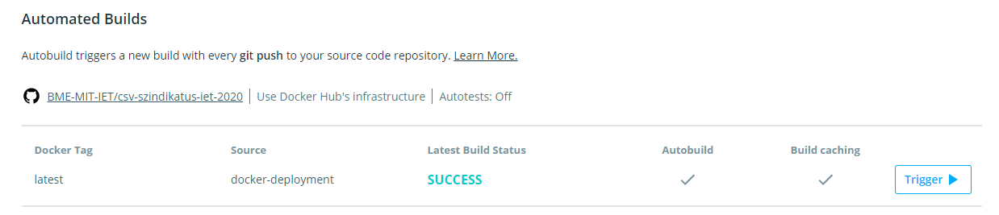

# Deployment segítése

A deployment segítését <b>Dockerhub</b> segítségével valósítottuk meg. Cél az volt, hogy automata buildelést valósítsunk meg. Először is létrehoztunk Dockerhub-on egy tárhelyet és összekötöttük a github tárhelyünkkel. Erre a célra készítettünk egy külön ágat, ami ritkán változik (<b>docker-deployment</b>). Ha tehát változás érkezik a <b>docker-deployment</b> branchen, akkor Dockerhubon automatikusan megtörténik a build.

